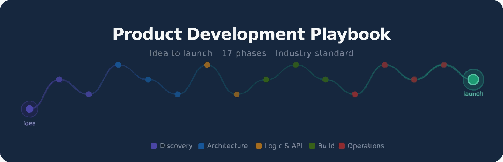

<div align="center">

<picture>
  
</picture>

<br/><br/>

[](./LICENSE)
[](./CONTRIBUTING.md)
[](./CONTRIBUTING.md)


<br/>

[📖 Read the Full Guide](./GUIDE.md) · [🐛 Report an Issue](https://github.com/heyitskuril/product-development-playbook/issues) · [🤝 Contribute](./CONTRIBUTING.md) · [⭐ Star this repo](https://github.com/heyitskuril/product-development-playbook)

<br/>

</div>

---

## What is this?

The **Product Development Playbook** is a free, open-source reference guide for engineers, product managers, CTOs, and indie hackers who want to build tech products the right way — with industry-standard practices at every phase of the lifecycle.

It covers everything from validating a problem to launching a production-ready product and iterating post-launch, with every phase backed by real references from recognized books, standards bodies, and engineering organizations.

> No fluff. No opinions without citations. Just a practical, validated guide you can actually use — whether you're building solo or leading a team of 50.

**Methodology:** Lean + Agile + Shape Up hybrid  
**Scope:** Any tech product — web app, mobile app, SaaS, platform, API, or internal tool  
**Standard:** Industry-grade, production-ready

---

## Why this exists

Most product failures aren't caused by bad code. They're caused by:

- Building something the market doesn't need (**42% of startup failures** — CB Insights, 2021)
- Skipping architecture decisions that become expensive to reverse
- Treating security and testing as afterthoughts
- Having no shared process across roles

This playbook is the shared process.

---

## Who is this for?

| Role | How to use this guide |
|------|----------------------|
| 🧑‍💻 **Solo Developer / Indie Hacker** | Follow the 17 phases end-to-end before writing a single line of code |
| 👥 **Small Development Team (2–10)** | Use as a shared team standard and onboarding reference |
| 🏢 **Engineering Manager / Tech Lead** | Use phases as sprint planning inputs and definition-of-done references |
| 🧑‍💼 **Product Manager** | Use discovery, scoping, and roadmap phases as PM workflow |
| 🏗️ **CTO / Architect** | Use architecture, auth, data modeling, and security phases as design review checklists |
| 🚀 **DevOps / Platform Engineer** | Use deployment, monitoring, and security phases as infrastructure runbooks |
| 🎓 **Student / Bootcamp Graduate** | Learn how production-grade products are actually planned and built |

---

## The 17 Phases at a Glance

The full guide covers **17 sequential phases**, each with a checklist, deliverables, validated references, and role assignments.

> **The order matters.** Each phase depends on the one before it. The guide is designed to prevent the most common mistake in software: building before you've validated the problem, the data model, or the architecture.

```
DISCOVERY ──────────────────────────────────────────────────────────────────────────┐
  Phase 1: Product Discovery & Definition                                            │
  Phase 2: Feature Scoping (MVP First)                                               │
                                                                                     │
DESIGN ─────────────────────────────────────────────────────────────────────────────┤
  Phase 3: User Flow & Journey Mapping                                               │
  Phase 9: UI/UX Design                                                              │
                                                                                     │
ARCHITECTURE ───────────────────────────────────────────────────────────────────────┤
  Phase 4: Data Modeling & Database Design                                           │
  Phase 5: System Architecture                                                       │
  Phase 6: Authentication & Authorization                                            │
                                                                                     │
LOGIC & API ────────────────────────────────────────────────────────────────────────┤
  Phase 7: Business Logic Definition                                                 │
  Phase 8: API Design (Contract First)                                               │
  Phase 10: Edge Case & Failure Planning                                             │
                                                                                     │
DEVELOPMENT ────────────────────────────────────────────────────────────────────────┤
  Phase 11: Project Structure & Coding Standards                                     │
  Phase 12: Development Roadmap                                                      │
  Phase 13: Testing Strategy                                                         │
                                                                                     │
OPERATIONS ─────────────────────────────────────────────────────────────────────────┤
  Phase 14: Deployment Plan                                                          │
  Phase 15: Monitoring & Observability                                               │
  Phase 16: Security Checklist                                                       │
  Phase 17: Post-Launch & Iteration                                                  │
                                                                                     │
LAUNCH ─────────────────────────────────────────────────────────────────────────────┘
```

---

### Phase Summary

| # | Phase | Category | Key Outputs | Primary Roles |
|---|-------|----------|-------------|---------------|
| 1 | 🧠 Product Discovery & Definition | Discovery | Product Brief, Personas, Competitor Analysis | PM, CTO |
| 2 | 📋 Feature Scoping (MVP First) | Discovery | Feature List (MoSCoW), User Stories + Acceptance Criteria | PM, CTO |
| 3 | 🔄 User Flow & Journey Mapping | Design | Flow Diagrams, Screen Inventory, Journey Map | UX, PM |
| 4 | 🧱 Data Modeling & Database Design | Architecture | ERD, Data Dictionary, DB Schema | CTO, Dev |
| 5 | ⚙️ System Architecture | Architecture | Architecture Diagram (C4), ADRs, Tech Stack Doc | CTO, Dev |
| 6 | 🔐 Authentication & Authorization | Architecture | Auth Flow, RBAC Matrix, Token Lifecycle | CTO, Dev, Security |
| 7 | 🧩 Business Logic Definition | Logic & API | Business Rules, State Machines, Formula Docs | PM, CTO, Dev |
| 8 | 🔌 API Design (Contract First) | Logic & API | OpenAPI Spec, Mock Server, API Docs | CTO, Dev |
| 9 | 🎨 UI/UX Design | Design | Wireframes, Mockups, Design System | UX, PM |
| 10 | ⚠️ Edge Case & Failure Planning | Logic & API | Edge Case Checklist, Error Message Library | CTO, Dev, PM |
| 11 | 🗂️ Project Structure & Standards | Development | Scaffold, README, CONTRIBUTING, Linter Config | CTO, Dev |
| 12 | 📅 Development Roadmap | Development | Milestone Plan, Definition of Done, Sprint Board | PM, CTO |
| 13 | 🧪 Testing Strategy | Development | Unit + Integration + E2E Test Suites, Testing Plan | Dev, CTO |
| 14 | 🚀 Deployment Plan | Operations | CI/CD Pipeline, Deployment Runbook, Rollback Plan | DevOps, CTO |
| 15 | 📊 Monitoring & Observability | Operations | Dashboards, Alerts, Runbooks, SLO Definitions | DevOps, CTO, Dev |
| 16 | 🔒 Security Checklist | Operations | OWASP Coverage, Security Scan Results, Threat Model | Security, CTO, Dev |
| 17 | 🔁 Post-Launch & Iteration | Operations | Post-Launch Report, Updated Backlog | PM, CTO, Dev |

---

## What each phase contains

Every phase in the [full guide](./GUIDE.md) includes:

**✅ Action Checklist** — Concrete, specific tasks with no ambiguity about what "done" means.

**📌 Deliverable Outputs** — Exact files and artifacts produced (e.g., `docs/erd.png`, `openapi.yaml`, `ci.yml`).

**⚠️ Critical Warnings** — Real data on what goes wrong when this phase is skipped, with citations.

**📚 Book References** — Validated recommendations with author, year, and rationale for relevance.

**🔗 Online Resources** — Links to recognized standards bodies: OWASP, W3C, NIST, IETF, Google, Microsoft, ThoughtWorks.

**👥 Role Assignments** — Which roles are responsible and which are consulted per phase.

**🔗 Prerequisite Dependencies** — Which phases must be completed first, and why.

---

## Dependency Map

Not all phases are independent. The map below shows what must be complete before you can begin each phase:

```
Phase 1 (Discovery)
    └── Phase 2 (Scoping)
            ├── Phase 3 (Flows)
            │       └── Phase 9 (UI/UX Design)
            ├── Phase 4 (Data Model)
            │       └── Phase 5 (Architecture)
            │               └── Phase 6 (Auth)
            │                       └── Phase 7 (Business Logic)
            │                               └── Phase 8 (API Design)
            │                                       └── Phase 10 (Edge Cases)
            │                                               └── Phase 13 (Testing)
            └── Phase 11 (Project Standards)
                    └── Phase 12 (Roadmap)
                            └── Phase 14 (Deployment)
                                    ├── Phase 15 (Monitoring)
                                    ├── Phase 16 (Security)
                                    └── Phase 17 (Post-Launch)
```

---

## Quick Start

**Option A — Read online**

Go straight to **[GUIDE.md](./GUIDE.md)** and start from Phase 1. Use the Table of Contents to jump to any phase.

**Option B — Clone locally**

```bash
git clone https://github.com/heyitskuril/product-development-playbook.git
cd product-development-playbook
```

Open `GUIDE.md` in your Markdown viewer, VS Code, or Obsidian.

**Option C — Use as a project template**

Fork this repo and use the `/docs` structure as the foundation for your own product documentation:

```
your-project/
├── docs/
│   ├── product-brief.md          ← Phase 1
│   ├── feature-list.md           ← Phase 2
│   ├── user-stories.md           ← Phase 2
│   ├── flows/                    ← Phase 3
│   ├── screen-inventory.md       ← Phase 3
│   ├── erd.png                   ← Phase 4
│   ├── data-dictionary.md        ← Phase 4
│   ├── architecture.md           ← Phase 5
│   ├── tech-stack.md             ← Phase 5
│   ├── adr/                      ← Phase 5
│   ├── auth-flow.md              ← Phase 6
│   ├── rbac-matrix.md            ← Phase 6
│   ├── business-rules.md         ← Phase 7
│   ├── state-machines.md         ← Phase 7
│   ├── api/
│   │   ├── openapi.yaml          ← Phase 8
│   │   └── README.md             ← Phase 8
│   ├── design-system.md          ← Phase 9
│   ├── edge-cases.md             ← Phase 10
│   ├── roadmap.md                ← Phase 12
│   ├── testing-plan.md           ← Phase 13
│   ├── deployment.md             ← Phase 14
│   ├── rollback.md               ← Phase 14
│   ├── monitoring.md             ← Phase 15
│   ├── runbooks/                 ← Phase 15
│   ├── security-checklist.md     ← Phase 16
│   ├── threat-model.md           ← Phase 16
│   └── post-launch-report.md     ← Phase 17
├── design/
│   ├── wireframes/               ← Phase 9
│   └── mockups/                  ← Phase 9
├── tests/                        ← Phase 13
├── .env.example                  ← Phase 11
├── README.md
└── CONTRIBUTING.md               ← Phase 11
```

---

## Referenced Standards & Organizations

This guide is grounded in industry-recognized standards and research, not opinion:

| Standard / Source | Category | Used In |
|-------------------|----------|---------|
| [OWASP Top 10 (2021)](https://owasp.org/Top10/) | Security | Phases 6, 16 |
| [OWASP Cheat Sheet Series](https://cheatsheetseries.owasp.org/) | Security | Phases 6, 16 |
| [NIST SP 800-63B](https://pages.nist.gov/800-63-3/sp800-63b.html) | Identity & Passwords | Phase 16 |
| [OpenAPI 3.1 Specification](https://spec.openapis.org/oas/v3.1.0) | API Design | Phase 8 |
| [WCAG 2.1 — W3C](https://www.w3.org/WAI/WCAG21/quickref/) | Accessibility | Phase 9 |
| [RFC 8725 — JWT Best Practices (IETF)](https://datatracker.ietf.org/doc/html/rfc8725) | Auth | Phase 6 |
| [DORA Research](https://dora.dev/) | Engineering Performance | Phases 12, 14 |
| [The 12-Factor App](https://12factor.net/) | Cloud-Native | Phases 5, 14 |
| [C4 Model](https://c4model.com/) | Architecture Diagramming | Phase 5 |
| [ADR Format](https://adr.github.io/) | Architecture Decisions | Phase 5 |
| [Google SRE Book](https://sre.google/sre-book/) | Site Reliability | Phase 15 |
| [OpenTelemetry](https://opentelemetry.io/) | Observability | Phase 15 |
| [Google Core Web Vitals](https://web.dev/vitals/) | Performance | Phases 13, 15 |
| [Conventional Commits](https://www.conventionalcommits.org/) | Version Control | Phase 11 |
| [Semantic Versioning](https://semver.org/) | Version Control | Phase 11 |

---

## Key Book References

The guide references 27 industry-standard books. The most frequently cited:

| Book | Author | Year | Phases |
|------|--------|------|--------|
| *Inspired* (2nd Ed) | Marty Cagan | 2018 | 1, 2 |
| *The Lean Startup* | Eric Ries | 2011 | 1, 17 |
| *The Mom Test* | Rob Fitzpatrick | 2013 | 1 |
| *Shape Up* | Ryan Singer (Basecamp) | 2019 | 2, 12 |
| *Domain-Driven Design* | Eric Evans | 2003 | 7 |
| *Designing Data-Intensive Applications* | Martin Kleppmann | 2017 | 4, 5 |
| *Clean Architecture* | Robert C. Martin | 2017 | 5, 11 |
| *Building Microservices* (2nd Ed) | Sam Newman | 2021 | 5 |
| *Accelerate* | Forsgren, Humble, Kim | 2018 | 12, 14 |
| *Continuous Delivery* | Humble & Farley | 2010 | 14 |
| *Release It!* (2nd Ed) | Michael Nygard | 2018 | 10 |
| *Site Reliability Engineering* | Google | 2016 | 15 |
| *Refactoring UI* | Wathan & Schoger | 2018 | 9 |
| *The Pragmatic Programmer* (20th Ed) | Hunt & Thomas | 2019 | 11, 13 |

Full reference list with rationale is in [GUIDE.md → Master Reference Library](./GUIDE.md#-master-reference-library).

---

## Master Progress Checklist

Use this as a project kick-off tracker:

| # | Phase | Status | Primary Output |
|---|-------|--------|----------------|
| 1 | Product Discovery & Definition | ⬜ Not started | Product Brief, Personas |
| 2 | Feature Scoping (MVP First) | ⬜ Not started | Feature List, User Stories |
| 3 | User Flow & Journey Mapping | ⬜ Not started | Flow Diagrams, Screen Inventory |
| 4 | Data Modeling & Database Design | ⬜ Not started | ERD, Data Dictionary |
| 5 | System Architecture | ⬜ Not started | Architecture Diagram, ADRs |
| 6 | Authentication & Authorization | ⬜ Not started | Auth Flow, RBAC Matrix |
| 7 | Business Logic Definition | ⬜ Not started | Business Rules, State Machines |
| 8 | API Design (Contract First) | ⬜ Not started | OpenAPI Spec, API Docs |
| 9 | UI/UX Design | ⬜ Not started | Wireframes, Design System |
| 10 | Edge Case & Failure Planning | ⬜ Not started | Edge Case Checklist |
| 11 | Project Structure & Standards | ⬜ Not started | Scaffold, README, CONTRIBUTING |
| 12 | Development Roadmap | ⬜ Not started | Milestone Plan, Sprint Board |
| 13 | Testing Strategy | ⬜ Not started | Test Suite, Testing Plan |
| 14 | Deployment Plan | ⬜ Not started | CI/CD Pipeline, Runbook |
| 15 | Monitoring & Observability | ⬜ Not started | Dashboards, Alerts, Runbooks |
| 16 | Security Checklist | ⬜ Not started | OWASP Coverage, Threat Model |
| 17 | Post-Launch & Iteration | ⬜ Not started | Post-Launch Report |

---

## OWASP Top 10 Coverage (2021)

Security is not a single phase — it runs through the entire guide. Here's the OWASP Top 10 coverage map:

| Rank | Risk | Covered In |
|------|------|------------|
| A01 | Broken Access Control | Phase 6 (RBAC design), Phase 16 (server-side enforcement) |
| A02 | Cryptographic Failures | Phase 6 (token storage), Phase 16 (password hashing, data-at-rest encryption) |
| A03 | Injection (SQL, XSS, etc.) | Phase 16 (parameterized queries, input sanitization, CSP header) |
| A04 | Insecure Design | Phase 5 (threat modeling), Phase 6 (security requirements in design) |
| A05 | Security Misconfiguration | Phase 14 (environment hardening), Phase 16 (security headers) |
| A06 | Vulnerable Components | Phase 16 (dependency scanning: npm audit, Snyk, Dependabot) |
| A07 | Auth & Session Failures | Phase 6 (httpOnly cookies, token lifetimes, logout invalidation) |
| A08 | Software Integrity Failures | Phase 14 (dependency lockfiles, CI integrity checks) |
| A09 | Logging & Monitoring Failures | Phase 15 (structured logging, auth event logging, anomaly alerts) |
| A10 | SSRF | Phase 16 (URL allowlisting, internal IP range blocking) |

---

## Contributing

This guide is open to contributions from the community. Found a broken link? Know a better reference? Want to add a missing best practice or translate a phase?

👉 Read [CONTRIBUTING.md](./CONTRIBUTING.md) to get started.

**Ways to contribute:**

- Fix a broken link or outdated reference
- Add a missing tool, book, or online resource to any phase
- Improve clarity or fix a typo
- Add a language translation
- Share how you adapted this guide for your team

All contributions — large or small — are reviewed and appreciated. Please open an issue before submitting a large change so we can discuss the approach first.

---

## Changelog

| Version | Date | Summary |
|---------|------|---------|
| v1.0.0 | April 2026 | Initial public release — 17 phases, full reference library |

---

## License

This project is licensed under the [MIT License](./LICENSE).

You are free to use, copy, modify, distribute, and adapt this guide — for personal, team, or commercial use — with attribution.

---

## About the author

<div align="center">

<br/>

**Kuril**

A dreamer… still working on making it real.

<br/>

[](https://linkedin.com/in/heyitskuril)
[](https://instagram.com/heyitskuril)
[](https://github.com/heyitskuril)
[](mailto:kuril.dev@gmail.com)

<br/>

</div>

---

<div align="center">

If this guide saved you time or helped your team ship better — consider giving it a ⭐<br/>
It helps others find it.

<br/>

**[⭐ Star on GitHub](https://github.com/heyitskuril/product-development-playbook)**

<br/>

*Technology-agnostic. Language-agnostic. Team-size-agnostic.*<br/>
*Validated against: OWASP Top 10 (2021) · WCAG 2.1 · OpenAPI 3.1 · DORA (2023) · 12-Factor App · C4 Model*

</div>
